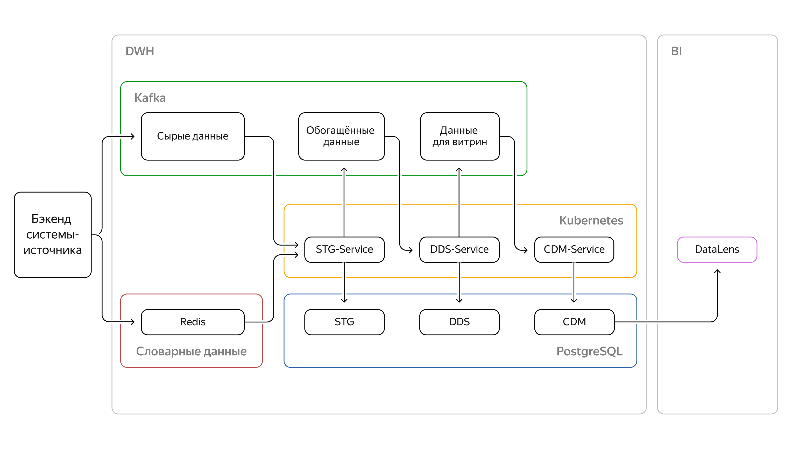

# Проект 9-го спринта

### Описание
Репозиторий предназначен для сдачи проекта 9-го спринта

### Структура репозитория
- `/sql`
- `/solution/service_cdm`
- `/solution/service_dds`
- `/solution/service_stg`

### Реджистри
- `cr.yandex/crpgdvingmkgn00fc06u/cdm_service:v2024-11-09-r1`
- `cr.yandex/crpgdvingmkgn00fc06u/dds_service:v2024-11-09-r1`
- `cr.yandex/crpgdvingmkgn00fc06u/stg_service:v2024-11-09-r1`

### Архитектура взаимодействия микросервисов

  

### Дашборд

  

